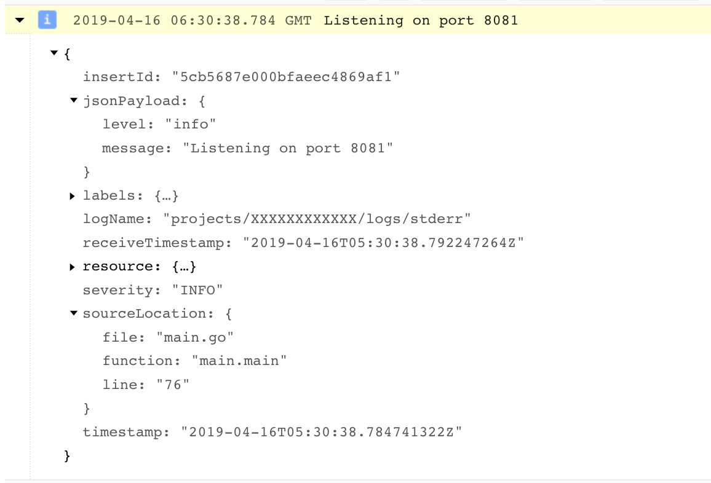

# Logrus formatter for App Engine

[](https://godoc.org/github.com/gelraen/appengine-formatter)

This package provides [logrus](https://github.com/sirupsen/logrus) formatter for
programs running on [Google App Engine](https://cloud.google.com/appengine/). It
 formats entries printed to stdout/stderr as JSON in a way that allows logging
 infrastructure to extract meaningful bits of information from them: uses
 predefined field names, maps severity levels to those expected etc.

## Example

```go

import (
	// ...

	log "github.com/sirupsen/logrus"
	"github.com/gelraen/appengine-formatter"
)

func main() {
	// ...

	log.SetReportCaller(true)  // optional, but highly recommended
	log.SetFormatter(&appengine.Formatter{})

	log.Printf("Listening on port %s", port)
	// ...
}
```

Resulting log entry looks like this:


